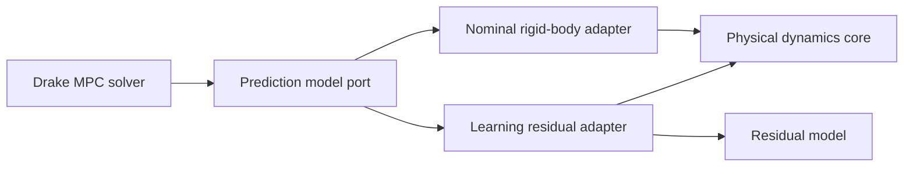

Architecture analysis and refactor recommendations based on [src/mpc_spacecraft/dynamics/rigid_body.py](src/mpc_spacecraft/dynamics/rigid_body.py), [src/mpc_spacecraft/controllers/mpc_nominal_drake.py](src/mpc_spacecraft/controllers/mpc_nominal_drake.py), [src/mpc_spacecraft/controllers/lqr.py](src/mpc_spacecraft/controllers/lqr.py), [src/mpc_spacecraft/dynamics/disturbances.py](src/mpc_spacecraft/dynamics/disturbances.py), and [src/mpc_spacecraft/controllers/mpc_learning_augmented.py](src/mpc_spacecraft/controllers/mpc_learning_augmented.py).

## Main coupling issues

- [NominalMPC.solve()](src/mpc_spacecraft/controllers/mpc_nominal_drake.py:182) depends directly on [SpacecraftDynamics.discrete_mpc_constraint()](src/mpc_spacecraft/dynamics/rigid_body.py:110). That makes the controller depend on a concrete dynamics class and an MPC-specific method name.
- [SpacecraftDynamics](src/mpc_spacecraft/dynamics/rigid_body.py:29) currently mixes three concerns:
  - physics propagation via [continuous_dynamics()](src/mpc_spacecraft/dynamics/rigid_body.py:53) and [discrete_dynamics_rk4()](src/mpc_spacecraft/dynamics/rigid_body.py:174),
  - geometry/error mapping via [state_error()](src/mpc_spacecraft/dynamics/rigid_body.py:244) and [state_from_error()](src/mpc_spacecraft/dynamics/rigid_body.py:286),
  - optimizer-facing assembly via [discrete_mpc_constraint()](src/mpc_spacecraft/dynamics/rigid_body.py:110).
- The learning stack highlights this mismatch: [HybridSpacecraftDynamics.linearize()](src/mpc_spacecraft/controllers/mpc_learning_augmented.py:187) is not used by [NominalMPC.solve()](src/mpc_spacecraft/controllers/mpc_nominal_drake.py:182), while [HybridSpacecraftDynamics.discretize_linear_system()](src/mpc_spacecraft/controllers/mpc_learning_augmented.py:257) overrides behavior expected by [SpacecraftDynamics.discrete_mpc_constraint()](src/mpc_spacecraft/dynamics/rigid_body.py:110). This is a design smell and potential correctness risk.

## Where those two methods should live

- [discrete_phi_lie_shifting_constraint()](src/mpc_spacecraft/dynamics/rigid_body.py:142): keep this as domain math, but move it out of the monolithic class into a dedicated error-linearization component (dynamics-side math utility/service).
- [discrete_mpc_constraint()](src/mpc_spacecraft/dynamics/rigid_body.py:110): move this to a controller-side model adapter (MPC-facing). It is not pure physics; it is optimizer constraint assembly.

A good rename after moving:
- [discrete_phi_lie_shifting_constraint()](src/mpc_spacecraft/dynamics/rigid_body.py:142) → “error-step SO(3) linearization” component.
- [discrete_mpc_constraint()](src/mpc_spacecraft/dynamics/rigid_body.py:110) → “affine error-step builder for MPC”.

## Recommended pattern: Adapter + Port (Dependency Inversion)

Use a prediction-model port that [NominalMPC](src/mpc_spacecraft/controllers/mpc_nominal_drake.py:10) depends on, then supply adapters:

- Nominal rigid-body adapter (uses [SpacecraftDynamics](src/mpc_spacecraft/dynamics/rigid_body.py:29)).
- Learning/hybrid adapter (uses [HybridSpacecraftDynamics](src/mpc_spacecraft/controllers/mpc_learning_augmented.py:24) internals or direct residual model logic).

This keeps MPC solver logic stable while swapping model implementations.

## Practical module boundary target

1. **Dynamics core (plant only)**
   - [continuous_dynamics()](src/mpc_spacecraft/dynamics/rigid_body.py:53)
   - [discrete_dynamics_rk4()](src/mpc_spacecraft/dynamics/rigid_body.py:174)
   - [discrete_dynamics_euler()](src/mpc_spacecraft/dynamics/rigid_body.py:205)

2. **Error coordinates / Lie math service**
   - [state_error()](src/mpc_spacecraft/dynamics/rigid_body.py:244)
   - [state_from_error()](src/mpc_spacecraft/dynamics/rigid_body.py:286)
   - extracted logic from [discrete_phi_lie_shifting_constraint()](src/mpc_spacecraft/dynamics/rigid_body.py:142)

3. **Controller-side prediction adapter**
   - provides what [NominalMPC.solve()](src/mpc_spacecraft/controllers/mpc_nominal_drake.py:182) needs each step: affine error dynamics matrices and offsets.

4. **Controllers**
   - [NominalMPC](src/mpc_spacecraft/controllers/mpc_nominal_drake.py:10) depends only on the port.
   - [LQRController](src/mpc_spacecraft/controllers/lqr.py:8) can optionally consume the same linearization service for consistency.

## Additional design improvements spotted

- [DisturbanceModel.__init__()](src/mpc_spacecraft/dynamics/disturbances.py:24) currently uses [np.random.seed()](src/mpc_spacecraft/dynamics/disturbances.py:48), which mutates global RNG state. Prefer a per-instance RNG for loose coupling and deterministic tests.
- Parameter naming: [dynamics_error_jacobian()](src/mpc_spacecraft/dynamics/rigid_body.py:92) uses an argument named `input`; rename to control-oriented naming for API clarity.
- Keep disturbance injection external: [DisturbanceModel.get_disturbance()](src/mpc_spacecraft/dynamics/disturbances.py:50) should remain a provider used by simulation/controller orchestration, not embedded into plant internals.

## Refactor sequence with lowest risk

1. Introduce a prediction-model port and switch [NominalMPC.__init__()](src/mpc_spacecraft/controllers/mpc_nominal_drake.py:18) to that abstraction.
2. Implement a nominal adapter that wraps current [SpacecraftDynamics](src/mpc_spacecraft/dynamics/rigid_body.py:29) behavior.
3. Move [discrete_mpc_constraint()](src/mpc_spacecraft/dynamics/rigid_body.py:110) into the adapter, keeping equations unchanged first.
4. Extract [discrete_phi_lie_shifting_constraint()](src/mpc_spacecraft/dynamics/rigid_body.py:142) into a math/linearization service used by the adapter.
5. Update [LearningAugmentedMPC](src/mpc_spacecraft/controllers/mpc_learning_augmented.py:269) to use a dedicated hybrid adapter so [HybridSpacecraftDynamics.linearize()](src/mpc_spacecraft/controllers/mpc_learning_augmented.py:187) becomes first-class and consistent.
6. Add contract tests around [NominalMPC.solve()](src/mpc_spacecraft/controllers/mpc_nominal_drake.py:182) with a fake adapter, then keep physics tests in [tests/test_dynamics.py](tests/test_dynamics.py:1) and controller behavior tests in [tests/test_mpc_nominal.py](tests/test_mpc_nominal.py:1).

This structure gives you loose coupling, clearer ownership boundaries, and a clean place for MPC-specific linearization logic without contaminating the plant model.